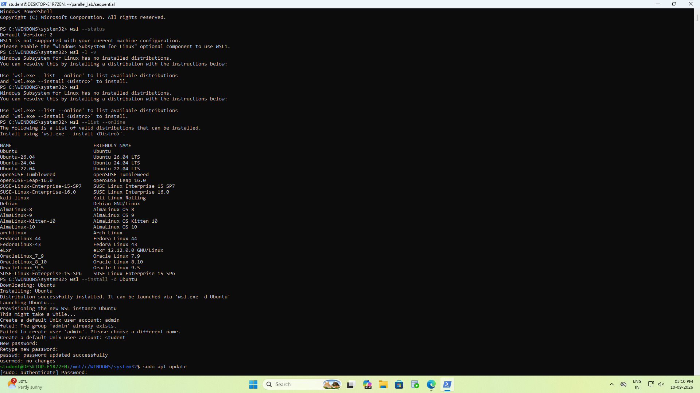
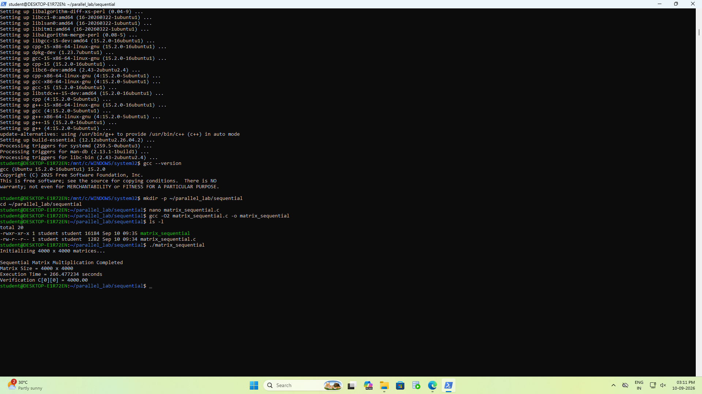
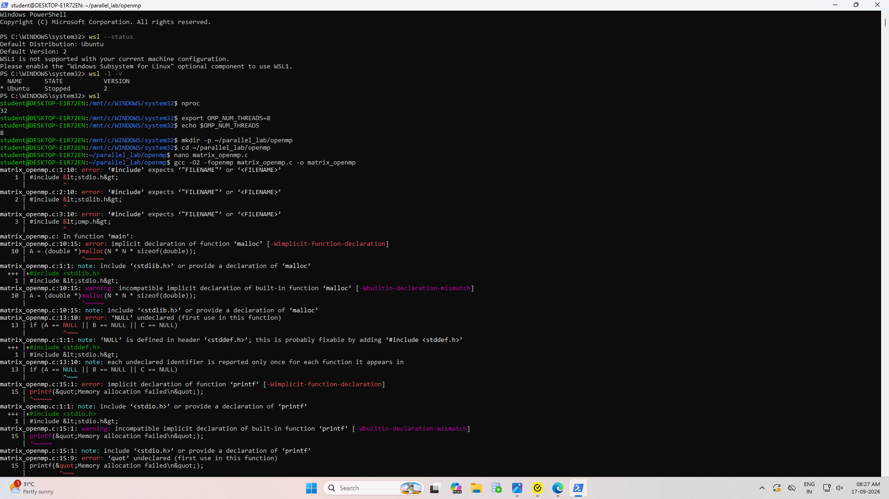
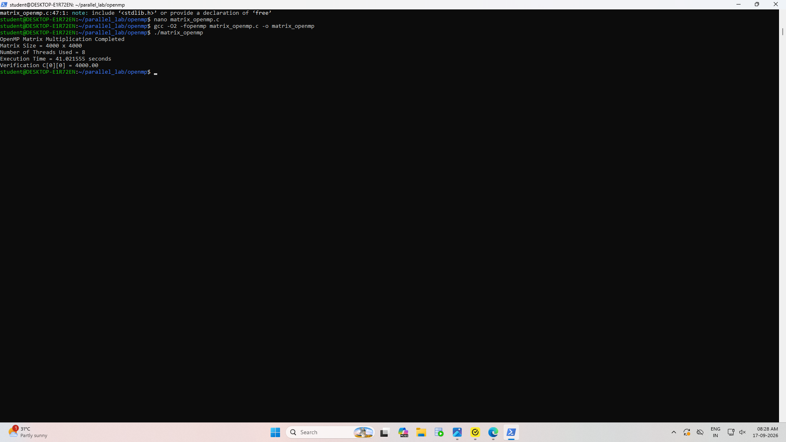
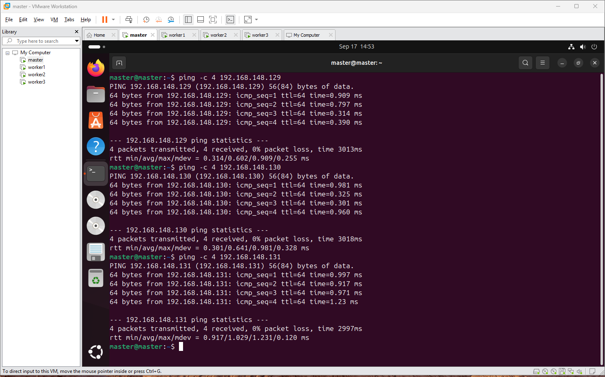
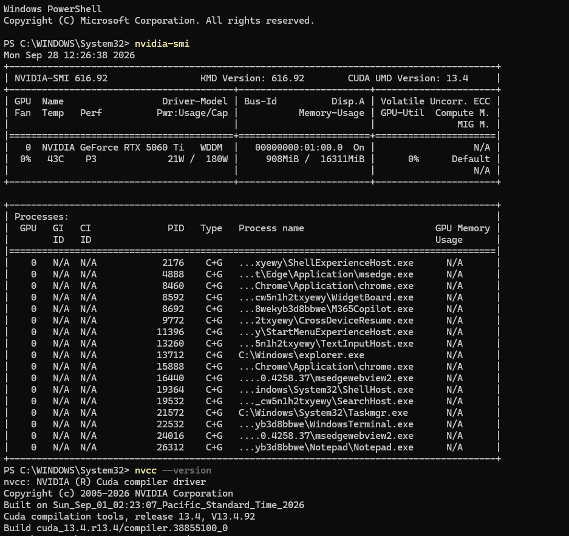
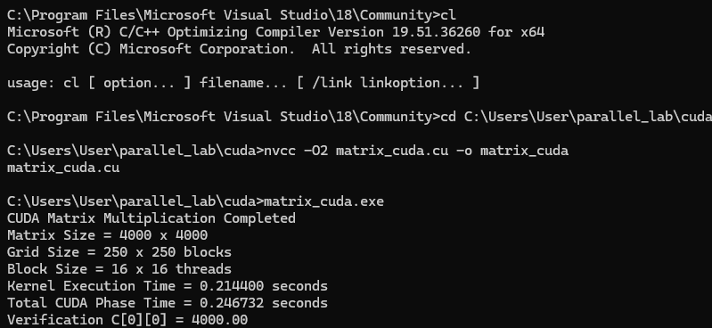

# Experiment 1 — Matrix Multiplication

## Overview

This experiment implements the same 4000 × 4000 matrix multiplication using four different parallel and computing models:

- Sequential CPU
- OpenMP shared-memory CPU
- MPI distributed-memory
- CUDA GPU

The purpose of this experiment is to understand the differences between sequential execution, shared-memory parallelism, distributed-memory parallelism, and GPU parallelism, and to compare their execution performance.

The execution flow for the experiment is:

Sequential CPU
↓
OpenMP Shared Memory
↓
MPI Distributed Memory
↓
CUDA GPU Parallelism
↓
Performance Comparison

The expected result for the top-left element of the output matrix `C[0][0]` is `4000.00`, because each element is the sum of 4000 products of `1.0 × 1.0`.

---

## 1. Problem Definition

- **Matrix A:** 4000 × 4000, all elements initialized to 1.0
- **Matrix B:** 4000 × 4000, all elements initialized to 1.0
- **Matrix C:** Output matrix, C = A × B
- Each output element in C is the sum of 4000 products of 1 × 1.
- Therefore, `C[0][0] = 4000.00`.

---

## 2. Computing Models Used

| Implementation | Computing Model | Main Resource | Parallelism |
|---|---|---|---|
| Sequential | Sequential CPU | CPU | Single execution flow |
| OpenMP | Shared Memory | CPU | Multiple CPU threads |
| MPI | Distributed Memory | Multiple processes/nodes | Process-level parallelism |
| CUDA | GPU Parallelism | NVIDIA GPU | Massive thread-level parallelism |

---

# Part A — Sequential Matrix Multiplication

## Objective

The sequential implementation performs the matrix multiplication using a normal CPU execution flow. It serves as the baseline for comparison against the parallel models.

## Configuration

| Parameter | Value |
|---|---|
| Matrix size | 4000 × 4000 |
| Execution model | Sequential CPU |
| Programming language | C / C++ |
| Compiler | GCC |
| Optimization flag | `-O2` |

## Implementation

The algorithm uses three nested loops:
- `i` → iterates over the rows of Matrix A
- `j` → iterates over the columns of Matrix B
- `k` → performs the multiplication and accumulation

A 1D array indexing approach is used for better cache locality and performance if implemented in the source code.

## Compilation

```bash
gcc -O2 matrix.c -o matrix
```

## Execution

```bash
./matrix
```

## Result

**Actual measured result:**

```text
Sequential Matrix Multiplication Completed
Matrix Size = 4000 x 4000
Execution Time = 256.171620 seconds
Verification C[0][0] = 4000.00
```

---

# Part B — OpenMP Matrix Multiplication

## Objective

OpenMP parallelizes the matrix multiplication by dividing the workload among multiple CPU threads while sharing the same memory space.

## Configuration

| Parameter | Value |
|---|---|
| Matrix size | 4000 × 4000 |
| OpenMP threads | 8 |
| Logical CPUs available | 32 |
| Compiler | GCC |
| Optimization | `-O2` |
| API | OpenMP |

## OpenMP Setup

```bash
export OMP_NUM_THREADS=8
```
This command configures the environment to use exactly 8 threads for the OpenMP execution.

## Parallelization

```c
#pragma omp parallel for private(j, k)
```
This pragma tells the compiler to parallelize the outer `i` loop. The iterations of the outer loop are distributed among the multiple CPU threads. The `j` and `k` loop variables are kept private to each thread to prevent data races.

## Compilation

```bash
gcc -O2 -fopenmp matrix_openmp.c -o matrix_openmp
```

## Execution

```bash
./matrix_openmp
```

## Result

**Actual measured result:**

```text
OpenMP Matrix Multiplication Completed
Matrix Size = 4000 x 4000
Number of Threads Used = 8
Execution Time = 40.364523 seconds
Verification C[0][0] = 4000.00
```

**Speedup:**
Speedup = Sequential Time / OpenMP Time
256.171620 / 40.364523 ≈ **6.34×** (Based on recorded execution times).

---

# Part C — MPI Distributed Matrix Multiplication

## Objective

MPI implements distributed-memory parallelism using multiple independent processes. Each MPI process has its own memory space and communicates with other processes using MPI message passing.

## Architecture

*To be recorded (e.g., Master/Worker node structure).*

## MPI Concepts Used

*To be recorded (e.g., MPI_Init, MPI_Comm_rank, MPI_Scatter, MPI_Bcast, MPI_Gather, MPI_Finalize).*

**Data Flow:**
Matrix A
↓
MPI_Scatter (Distributes portions of Matrix A)
↓
Different MPI processes compute portions
↓
MPI_Gather (Collects computed portions)
↓
Complete Matrix C

## Prerequisites

*To be recorded (e.g., Ubuntu, Open MPI, OpenSSH, hostfile, VM configuration).*

## Compilation

```bash
mpicc -O2 matrix_mpi.c -o matrix_mpi
```

## Execution

```bash
mpirun -np 4 ./matrix_mpi
```
*(Exact command to be recorded).*

## Result

*(See screenshot in evidence section; explicit values to be recorded).*

---

# Part D — CUDA Matrix Multiplication

## Objective

CUDA offloads the heavy matrix multiplication computation to an NVIDIA GPU. 

The execution flow is:
CPU prepares data
↓
Data transferred to GPU memory
↓
CUDA kernel executes matrix multiplication
↓
GPU computes output elements in parallel
↓
Result transferred back to CPU
↓
Verification

## GPU/CUDA Environment

| Component | Detail |
|---|---|
| GPU model | NVIDIA GeForce GTX 1050 |
| CUDA version | 13.0 |
| NVIDIA driver | 582.28 |
| GPU memory | 4096 MiB |
| nvcc version | *To be recorded* |

## CUDA Concepts Used

*To be recorded (e.g., CUDA kernel, Threads, Blocks, Grid, Device/Host memory, cudaMalloc, cudaMemcpy).*

## Execution Configuration

*To be recorded (e.g., Threads per block, Grid size).*

## Compilation

```bash
nvcc -O2 matrix_cuda.cu -o matrix_cuda
```

## Execution

```bash
./matrix_cuda
```

## Result

*To be recorded.*

---

# Results and Performance Comparison

| Implementation | Model | Resources | Execution Time | Verification | Speedup |
|---|---|---|---:|---:|---:|
| Sequential | CPU | 1 thread | 256.171620 s | 4000.00 | 1.00× |
| OpenMP | Shared Memory | 8 threads | 40.364523 s | 4000.00 | 6.34× |
| MPI | Distributed Memory | *To be recorded* | *To be recorded* | *To be recorded* | *To be recorded* |
| CUDA | GPU | GTX 1050 | *To be recorded* | *To be recorded* | *To be recorded* |

## Speedup Formula

**Speedup = Sequential Execution Time / Parallel Execution Time**

The sequential execution time establishes the baseline (1.00×) for all speedup calculations.

## Performance Discussion

- **Sequential CPU execution:** Serves as the baseline. It is the slowest because it relies on a single execution flow and does not leverage modern hardware concurrency.
- **OpenMP CPU thread parallelism:** Significantly faster (6.34× speedup) by dividing the work among 8 CPU threads, efficiently utilizing shared memory without network overhead.
- **MPI process-level distributed parallelism:** *Discussion to be recorded based on network overhead and communication latency versus distributed compute power.*
- **CUDA GPU thread-level parallelism:** *Discussion to be recorded based on massive thread concurrency and GPU memory transfer overhead.*

---

# Screenshots / Evidence

### Sequential
- Compilation/Execution/Verification:
  - 
  - 

### OpenMP
- Compilation/Execution/Verification:
  - 
  - 

### MPI
- Network/Ping setup:
  - 
  - 
- MPI execution/Result:
  - 

### CUDA
- Compilation/Execution/Verification:
  - 
  - 

---

# Troubleshooting

The following issues were identified or could be encountered during the experiment:

- **GCC not found:** Ensure the GNU Compiler Collection is installed (`sudo apt install build-essential` or equivalent).
- **OpenMP compilation errors:** Verify that the `-fopenmp` flag is passed to GCC.
- **Incorrect OpenMP thread count:** Check the `OMP_NUM_THREADS` environment variable before execution.
- **MPI connectivity problems:** Ensure nodes can communicate over the network and firewalls are correctly configured.
- **SSH problems:** Passwordless SSH must be configured between master and worker nodes for MPI.
- **MPI hostfile problems:** Verify that the hostfile contains the correct IP addresses and slot counts.
- **`mpirun` problems:** Verify that the Open MPI environment is correctly loaded in the path.
- **NVIDIA GPU detection problems:** Check `nvidia-smi` to ensure the driver is communicating with the GPU.
- **`nvcc` not found:** Ensure the CUDA Toolkit `bin` directory is added to the system `PATH`.
- **CUDA compilation/runtime errors:** Check device capability compatibility and memory allocation limits (cudaMalloc).

---

# Conclusion

In this experiment, the same 4000 × 4000 matrix multiplication problem was implemented using four computing models:

1. Sequential CPU execution
2. OpenMP shared-memory parallelism
3. MPI distributed-memory parallelism
4. CUDA GPU parallelism

All implementations successfully verified the output by calculating `C[0][0] = 4000.00`. 

The Sequential baseline completed in 256.171620 seconds. The OpenMP implementation using 8 threads achieved a significant execution time reduction to 40.364523 seconds, resulting in a 6.34× speedup. The specific impact of distributed messaging overhead (MPI) and massive thread concurrency (CUDA) will be evaluated once their performance data is fully recorded.
