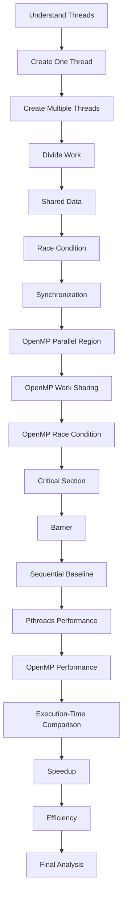

# Multithreaded Programming Using Pthreads and OpenMP

> **Lab entry — actual execution results from my WSL/Ubuntu run**
>
> This README records the programs, commands, observations, screenshots, and performance calculations from my own terminal execution. The supplied experiment document is used as the **reference**; the numerical results below are taken from my screenshots and therefore differ slightly from the reference values.

# Part A — Pthreads

## 4. Pthread Program 1 — Create One Thread

### File

```text
thread1.c
```

### Compile

```bash
gcc thread1.c -o thread1 -pthread
```

### Run

```bash
./thread1
```

### Actual output

```text
Hello from the thread!
Main thread finished.
```


### Concept

`pthread_create()` creates the additional thread, while `pthread_join()` makes the main thread wait for it to finish. The reference experiment uses the same program and explanation.

---

## 5. Pthread Program 2 — Create Multiple Threads

### File

```text
thread2.c
```

### Compile and run

```bash
gcc thread2.c -o thread2 -pthread
./thread2
```

### Actual output

```text
Hello from Thread 1
Hello from Thread 2
Hello from Thread 3
Hello from Thread 4
All threads have finished.
```

The important observation is that **thread execution order is not guaranteed**. The operating system scheduler can produce a different order on another run. This agrees with the reference explanation.

---

## 6. Pthread Program 3 — Divide Work Among Threads

### File

```text
thread_sum.c
```

The array used was:

```text
10 20 30 40 50 60 70 80
```

### Compile and run

```bash
gcc thread_sum.c -o thread_sum -pthread
./thread_sum
```

### Actual output

```text
Thread 1 calculated sum = 30
Thread 2 calculated sum = 70
Thread 3 calculated sum = 110
Thread 4 calculated sum = 150
Total sum = 360
```

### Work distribution

| Thread | Elements | Partial sum |
|---|---|---:|
| Thread 1 | 10 + 20 | 30 |
| Thread 2 | 30 + 40 | 70 |
| Thread 3 | 50 + 60 | 110 |
| Thread 4 | 70 + 80 | 150 |
| **Total** | **All elements** | **360** |

This demonstrates **work distribution**: one large task is divided into smaller pieces and assigned to different threads. The reference document uses the same array and expected total of 360.

---

## 7. Pthread Program 4 — Race Condition

### File

```text
race.c
```

### Compile and run

```bash
gcc race.c -o race -pthread
./race
```

### Expected value

There are 4 threads and each performs 100,000 increments:

```text
4 × 100000 = 400000
```

### Actual runs

I obtained different results on different executions:

| Run | Expected | Actual |
|---|---:|---:|
| 1 | 400000 | 167213 |
| 2 | 400000 | 161873 |
| 3 | 400000 | 142608 |
| 4 | 400000 | 125242 |

### Observation

The result changes between runs because multiple threads simultaneously execute:

```c
counter++;
```


The increment is a shared read-modify-write operation. Without synchronization, updates can be lost when threads access the shared variable concurrently.

This is a **race condition**. The reference document also demonstrates that the expected value is 400000 while the unsynchronized actual value can vary.

---

## 8. Pthread Program 5 — Fix Race Condition Using Mutex

### File

```text
mutex.c
```

### Compile and run

```bash
gcc mutex.c -o mutex -pthread
./mutex
```

### Actual output

```text
Expected counter = 400000
Actual counter = 400000
```

### Synchronization used

```c
pthread_mutex_lock(&mutex);
counter++;
pthread_mutex_unlock(&mutex);
```

The mutex ensures that only one thread at a time executes the protected increment. The reference experiment uses the same synchronization approach.

---

# Part B — OpenMP

## 9. OpenMP Program 1 — Basic Parallel Region

### File

```text
omp1.c
```

### Compile and run

```bash
gcc omp1.c -o omp1 -fopenmp
./omp1
```

### Actual observation

The terminal produced messages of the form:


```text
Hello from Thread 7 of 32
Hello from Thread 17 of 32
Hello from Thread 29 of 32
...
Hello from Thread 1 of 32
```

The run used a team of **32 OpenMP threads**.

The order was not sequential because OpenMP threads are scheduled independently.

The reference program uses:

```c
#pragma omp parallel
```

together with:

```c
omp_get_thread_num()
omp_get_num_threads()
```

to identify each thread and the total number of threads.

---

## 10. OpenMP Program 2 — Work Sharing and Reduction

### File

```text
omp_sum.c
```

### Compile and run

```bash
gcc omp_sum.c -o omp_sum -fopenmp
./omp_sum
```

### Actual output

The terminal showed work being distributed between OpenMP threads, for example:


```text
Thread 1 processing array[1] = 20
Thread 2 processing array[2] = 30
Thread 6 processing array[6] = 70
Thread 7 processing array[7] = 80
Thread 4 processing array[4] = 50
Thread 3 processing array[3] = 40
Thread 5 processing array[5] = 60
Thread 0 processing array[0] = 10

Total sum = 360
```

The exact order can vary.

### Important directive

```c
#pragma omp parallel for reduction(+:total_sum)
```

`parallel for` distributes loop iterations among threads, while `reduction` safely combines the partial sums into `total_sum`. The reference document describes the same mechanism.

---

## 11. OpenMP Program 3 — Race Condition

### File

```text
omp_race.c
```

### Compile and run

```bash
gcc omp_race.c -o omp_race -fopenmp
./omp_race
```

### Actual result

```text
Expected counter = 400000
Actual counter = 400000
```

In my captured run, the result happened to equal the expected value. **This does not make the program race-free.**

The program still contains unsynchronized shared access:

```c
counter++;
```

inside an OpenMP parallel region.

Therefore:

> The code contains a data race; one particular execution can nevertheless produce the expected value.

The reference document similarly explains that OpenMP manages threads but does not automatically make shared-data operations safe.

---

## 12. OpenMP Program 4 — Critical Section

### File

```text
ompcritical.c
```

### Compile and run

```bash
gcc ompcritical.c -o ompcritical -fopenmp
./ompcritical
```

### Actual output

```text
Expected counter = 400000
Actual counter = 400000
```

### Synchronization

```c
#pragma omp critical
{
    counter++;
}
```

Only one OpenMP thread at a time is allowed to execute the critical section.

---

## 13. OpenMP Program 5 — Barrier

### File

```text
ompbarrier.c
```

### Compile and run

```bash
gcc ompbarrier.c -o ompbarrier -fopenmp
./ompbarrier
```

### Actual output

```text
Thread 1 completed Stage 1
Thread 3 completed Stage 1
Thread 0 completed Stage 1
Thread 2 completed Stage 1

Thread 3 started Stage 2
Thread 2 started Stage 2
Thread 0 started Stage 2
Thread 1 started Stage 2
```

The exact order can change.

The important property is:

```text
ALL Stage 1 completions
        ↓
      BARRIER
        ↓
Stage 2 starts
```

The reference document defines the barrier as a point where every thread must arrive before any thread proceeds beyond it.

---

# Part C — Performance Analysis

## 14. Workload

The performance programs use:

```c
#define N 1000000000L
```

and repeatedly calculate:

```c
sum += (double)i * 0.000001;
```

The expected mathematical result reported by the programs is:

```text
499999999500.00
```

The reference experiment uses the same workload and result.

---

# 15. Sequential Baseline — My Actual Results

I ran the sequential program five times.

### Commands

```bash
gcc seq1.c -o seq1
./seq1
```

### Recorded execution times


| Run | Execution time |
|---:|---:|
| 1 | 1.374873 s |
| 2 | 1.385103 s |
| 3 | 1.387185 s |
| 4 | 1.372473 s |
| 5 | 1.376516 s |
| **Average** | **1.379230 s** |

### Calculation

```text
Average sequential time
= (1.374873 + 1.385103 + 1.387185 + 1.372473 + 1.376516) / 5
= 1.379230 seconds
```

Therefore, **1.379230 s** is used as my sequential baseline for all speedup and efficiency calculations below.

The reference document used a different five-run average of **1.353219 s**, so I have intentionally used my measured average rather than copying the reference value.

---

# 16. Pthreads Performance — My Actual Results

### Program

```text
pperf.c
```

### Compile

```bash
gcc pperf.c -o pperf -pthread
```

### Measured results

| Threads | Pthreads time |
|---:|---:|
| 1 | 1.370104 s |
| 2 | 0.713144 s |
| 4 | 0.358555 s |
| 6 | 0.239340 s |
| 16 | 0.144656 s |
| 32 | 0.086277 s |

The reference document reports Pthreads measurements only for 1, 2, 4, 6 and 16 threads. My additional 32-thread measurement is therefore an **extra measurement from my own run**. The reference values are 1.348142, 0.680737, 0.358872, 0.241345 and 0.144812 seconds respectively.

---

# 17. OpenMP Performance — My Actual Results

### Program

```text
omperf.c
```

### Compile

```bash
gcc omperf.c -o omperf -fopenmp
```

### Measured results


| Threads | OpenMP time |
|---:|---:|
| 1 | 1.397556 s |
| 2 | 0.716432 s |
| 4 | 0.360009 s |
| 6 | 0.242009 s |
| 16 | 0.143439 s |

The reference document reports the corresponding OpenMP values as 1.409294, 0.715560, 0.360803, 0.241608 and 0.140692 seconds.

---

# 18. Actual Performance Comparison

| Threads | Pthreads | OpenMP |
|---:|---:|---:|
| 1 | 1.370104 s | 1.397556 s |
| 2 | 0.713144 s | 0.716432 s |
| 4 | 0.358555 s | 0.360009 s |
| 6 | 0.239340 s | 0.242009 s |
| 16 | 0.144656 s | 0.143439 s |
| 32 | 0.086277 s | — |

> `—` means that no 32-thread OpenMP timing was captured in the supplied screenshots.


---

# 19. Speedup and Efficiency Calculations

### Formulas

```text
Speedup = Sequential baseline time / Parallel execution time

Efficiency = (Speedup / Number of threads) × 100
```

Using my measured sequential baseline:

```text
Sequential baseline = 1.379230 s
```

### Pthreads

| Threads | Time (s) | Speedup | Efficiency |
|---:|---:|---:|---:|
| 1 | 1.370104 | 1.007x | 100.67% |
| 2 | 0.713144 | 1.934x | 96.70% |
| 4 | 0.358555 | 3.847x | 96.17% |
| 6 | 0.239340 | 5.763x | 96.04% |
| 16 | 0.144656 | 9.535x | 59.59% |
| 32 | 0.086277 | 15.986x | 49.96% |

### OpenMP

| Threads | Time (s) | Speedup | Efficiency |
|---:|---:|---:|---:|
| 1 | 1.397556 | 0.987x | 98.69% |
| 2 | 0.716432 | 1.925x | 96.26% |
| 4 | 0.360009 | 3.831x | 95.78% |
| 6 | 0.242009 | 5.699x | 94.98% |
| 16 | 0.143439 | 9.615x | 60.10% |

The reference document uses these same formulas but obtains different numerical values because its timings are different.


---

# 20. Key Calculated Results

### Highest measured Pthreads speedup

```text
Threads       = 32
Time          = 0.086277 s
Speedup       = 15.986x
Efficiency    = 49.96%
```

### Highest measured OpenMP speedup in my captured data

```text
Threads       = 16
Time          = 0.143439 s
Speedup       = 9.615x
Efficiency    = 60.10%
```

The 32-thread Pthreads result should not be compared against a missing 32-thread OpenMP value as though both were measured. It is simply an additional Pthreads data point from this run.

Efficiency is not perfectly constant because adding threads introduces overhead such as scheduling, synchronization, memory access, thread management and non-parallel work.

---

# 21. My Results vs Reference Document

The supplied reference document is treated only as the reference dataset. My terminal measurements are retained as the actual lab results.

## Sequential baseline

| Measurement | My result | Reference |
|---|---:|---:|
| Average time | **1.379230 s** | 1.353219 s |
| Difference | +0.026011 s | — |
| Relative difference | **+1.92%** | — |

## Pthreads and OpenMP timings

`Relative difference = (My time − Reference time) / Reference time × 100`

| Threads | My Pthreads | Ref. Pthreads | Difference | My OpenMP | Ref. OpenMP | Difference |
|---:|---:|---:|---:|---:|---:|---:|
| 1 | 1.370104 | 1.348142 | +1.63% | 1.397556 | 1.409294 | -0.83% |
| 2 | 0.713144 | 0.680737 | +4.76% | 0.716432 | 0.715560 | +0.12% |
| 4 | 0.358555 | 0.358872 | -0.09% | 0.360009 | 0.360803 | -0.22% |
| 6 | 0.239340 | 0.241345 | -0.83% | 0.242009 | 0.241608 | +0.17% |
| 16 | 0.144656 | 0.144812 | -0.11% | 0.143439 | 0.140692 | +1.95% |

The reference comparison values come directly from its final performance table.

### Interpretation

Small timing differences are expected between runs because execution time depends on the actual machine and runtime conditions.

- My sequential average is about **1.92% slower** than the reference baseline.
- My 4-thread Pthreads time is almost identical to the reference value.
- My 16-thread Pthreads time is also very close to the reference value.
- My 16-thread OpenMP time is slightly higher than the reference value.
- My Pthreads test additionally includes a **32-thread measurement** that is not present in the reference table.

---

# 22. Race Condition vs Synchronization

| Program | Technique | Expected | Observed |
|---|---|---:|---:|
| `race.c` | No synchronization | 400000 | 125242–167213 in captured runs |
| `mutex.c` | Pthread mutex | 400000 | 400000 |
| `omp_race.c` | No synchronization | 400000 | 400000 in captured run |
| `ompcritical.c` | OpenMP critical | 400000 | 400000 |

> An unsynchronized program producing the correct value once does **not** prove that the race condition has disappeared.

---

# 23. Pthreads vs OpenMP

| Concept | Pthreads | OpenMP |
|---|---|---|
| Thread creation | `pthread_create()` | `#pragma omp parallel` |
| Waiting/coordination | `pthread_join()` | Runtime/structured parallel region |
| Work distribution | Programmer-managed | `parallel for` can distribute iterations |
| Shared-data protection | `pthread_mutex_lock()` / unlock | `#pragma omp critical` |
| Loop result combination | Programmer-managed partial sums | `reduction(...)` |
| Explicit barrier | Join/synchronization mechanisms | `#pragma omp barrier` |
| Programming level | Lower-level/manual control | Higher-level/directive based |

The reference document makes the same conceptual distinction between Pthreads and OpenMP.

---

# 24. Programs Implemented

## Pthreads

```text
thread1.c       → Create one thread
thread2.c       → Create multiple threads
thread_sum.c    → Divide work among threads
race.c          → Demonstrate race condition
mutex.c         → Fix race condition using mutex
pperf.c         → Performance measurement
```

## OpenMP

```text
omp1.c          → Parallel region and thread identification
omp_sum.c       → Work sharing and reduction
omp_race.c      → Demonstrate race condition
ompcritical.c   → Synchronization using critical
ompbarrier.c    → Thread coordination
omperf.c        → Performance measurement
```

This follows the program categories in the reference experiment.

---

# 25. Execution Flow



---

# 26. Screenshots / Experimental Evidence

The following screenshots show the actual terminal execution of the programs.

## Pthreads


## OpenMP


## Performance


## Evidence Folder


# 27. Observations

1. A program begins with a main thread; `pthread_create()` can add additional threads.
2. Multiple Pthreads can execute in an unpredictable order.
3. Work can be divided into independent pieces and processed by different threads.
4. Shared variables can cause race conditions when multiple threads update them without synchronization.
5. A Pthread mutex protects a critical update.
6. OpenMP provides a higher-level way to create and manage parallel execution.
7. `parallel for` distributes loop iterations between OpenMP threads.
8. `reduction` safely combines partial results.
9. `critical` protects a shared operation in OpenMP.
10. A `barrier` forces threads to reach a synchronization point before continuing.
11. Increasing the number of threads reduced execution time substantially for this workload.
12. The reduction in execution time was not perfectly linear.
13. My measured Pthreads execution reached **0.086277 s at 32 threads**.
14. My measured OpenMP execution reached **0.143439 s at 16 threads**.
15. Performance measurements are machine- and runtime-dependent, so the values in the reference document and my terminal do not have to be identical.

---

# 28. Final Result

The experiment successfully demonstrated multithreaded programming using both **Pthreads** and **OpenMP**.

The Pthreads portion demonstrated:

```text
Thread creation
        ↓
Multiple threads
        ↓
Work distribution
        ↓
Race condition
        ↓
Mutex synchronization
        ↓
Performance measurement
```

The OpenMP portion demonstrated:

```text
Parallel region
        ↓
Work sharing
        ↓
Reduction
        ↓
Race condition
        ↓
Critical section
        ↓
Barrier synchronization
        ↓
Performance measurement
```

For the performance workload, my sequential baseline was:

```text
1.379230 seconds
```

My measured Pthreads times decreased from:

```text
1.370104 s  →  0.086277 s
1 thread       32 threads
```

My measured OpenMP times decreased from:

```text
1.397556 s  →  0.143439 s
1 thread       16 threads
```

Using the measured sequential baseline, the calculated maximum captured speedups were:

```text
Pthreads : 15.986x at 32 threads
OpenMP   : 9.615x at 16 threads
```

These results demonstrate that parallel execution can substantially reduce execution time for a suitable computational workload, while also showing that speedup is not perfectly proportional to the number of threads because of parallelization overhead.

---

# 29. Final Conclusion

This experiment provided practical experience with the complete multithreading workflow:

> **Create → Manage → Divide Work → Share Data → Handle Race Conditions → Synchronize → Coordinate → Measure Performance → Analyze Results**

Pthreads provided explicit control over thread creation, joining and mutex-based synchronization. OpenMP provided a higher-level model using parallel regions, work-sharing directives, reductions, critical sections and barriers. The reference document describes this same overall learning flow and conclusion. 

The actual measurements in this README are intentionally **not replaced with the reference values**. They are calculated from the timings captured in my own screenshots, making this README a record of my actual experiment.

---

