# Theme 10: Comparative Performance Analysis of CPU vs. GPU Data Processing (OpenMP and CUDA)


- Course: Parallel & Distributed Computing Laboratory
- System Details: Ubuntu 24.04 LTS (WSL2), GCC 13.x (OpenMP), NVIDIA CUDA (nvcc 13.3)

## 2. Laboratory Overview and Environment

This laboratory compares the performance characteristics of CPU-centric OpenMP execution and GPU-centric CUDA execution for large-scale numerical data processing. The central architectural contrast is the emphasis of the CPU on latency optimization and the GPU on throughput optimization. A modern CPU is designed around large caches, branch prediction, aggressive out-of-order execution, and low-latency control logic, making it effective for irregular workloads and smaller vector lengths where data locality and control flow are dominant. In contrast, a GPU is organized as a collection of streaming multiprocessors that execute many threads in lockstep using the Single Instruction Multiple Thread (SIMT) model. The GPU sacrifices single-thread latency in favor of massive throughput, with hardware warp scheduling, wide memory buses, and specialized arithmetic units. This makes it highly efficient for dense, homogeneous workloads where the same instruction is applied to many independent data points.

The experimental study investigates workloads over a practical and representative problem dimension range of N = 10^5 to 3 * 10^7. These sizes are large enough to expose memory subsystem effects, PCIe transfer overheads, and parallel scalability, yet still reflect realistic scientific and engineering data-processing pipelines. In this setting, the CPU and GPU are evaluated not only by absolute runtime, but also by how they scale with increasing data volume, how they react to memory bandwidth constraints, and how arithmetic intensity determines the crossover point between host and device acceleration.

## 3. Repository Layout

```text
cpu-vs-gpu-parallel-computing/
├── bin/
│   ├── saxpy_sequential
│   ├── saxpy_openmp
│   ├── saxpy_cuda
│   └── run_benchmarks.py
├── docs/
│   └── screenshots/
│       ├── 01_compilation_and_sequential.png
│       ├── 02_openmp_thread_scaling.png
│       ├── 03_cuda_block_and_size_sweep.png
│       ├── 04_automated_benchmark_run.png
│       ├── 05_timings_csv_table.png
│       ├── 06_sin_individual_verification.png
│       └── 07_sin_benchmark_suite.png
├── graphs/
│   ├── execution_time_comparison.png
│   ├── speedup_curves.png
│   ├── execution_time_bar_chart.png
│   ├── cuda_breakdown_bar_chart.png
│   ├── sin_execution_time_comparison.png
│   ├── sin_speedup_curves.png
│   └── sin_bar_chart.png
├── results/
│   ├── bench_timings.csv
│   ├── saxpy_summary.txt
│   └── trigonometric_summary.txt
├── src/
│   ├── saxpy_sequential.cpp
│   ├── saxpy_openmp.cpp
│   ├── saxpy_cuda.cu
│   ├── trigonometric_openmp.cpp
│   ├── trigonometric_cuda.cu
│   ├── benchmark_runner.py
│   └── plot_results.py
├── README.MD
├── Makefile
└── run_benchmarks.py
```

## 4. Experiment 1: Extended SAXPY Vector Transformation (Memory-Bound)

The first workload evaluates a memory-bound vector transformation defined as:

Z[i] = sqrt(X[i]^2 + Y[i]^2) + alpha * X[i]

This formulation is characteristic of a streaming memory workload: each element requires reading X[i] and Y[i], performing a square-root and square operations, and writing the result Z[i]. In this computation, each element reads approximately 8 bytes (two 4-byte floating-point inputs) and writes 4 bytes (one output). The arithmetic work is roughly six floating-point operations, including the square operations, addition, multiplication, and the sqrt call. Consequently, the arithmetic intensity is about 0.50 FLOP/byte, which is low. This places the workload squarely in the memory-bandwidth bound regime: the cost is dominated by moving data between memory and the processor rather than by the arithmetic operations themselves. As N increases, the CPU is constrained by memory bandwidth and cache behavior, while the GPU also becomes bandwidth-limited when the transfer and kernel-launch overheads are not amortized by sufficiently large arithmetic work.

### 4.1 Sequential C++

The baseline implementation provides reference behavior and establishes the single-thread execution time without parallelism. It serves as the benchmark against which OpenMP and CUDA speedups are measured.

```cpp
#include <cmath>
#include <vector>

void compute_sequential(const std::vector<float>& X,
                       const std::vector<float>& Y,
                       std::vector<float>& Z,
                       float alpha,
                       std::size_t n) {
    for (std::size_t i = 0; i < n; ++i) {
        float x = X[i];
        float y = Y[i];
        Z[i] = std::sqrt(x * x + y * y) + alpha * x;
    }
}
```

The sequential reference is important because it guarantees correctness and produces a stable baseline for all performance comparisons. At small N values, the CPU excels because data remain in L1/L2 cache and the latency-optimized core can process the stream with minimal overhead. As N grows beyond the cache footprint, the problem consumes memory bandwidth and the effective throughput begins to flatten. This is a key observation in later comparisons with multithreaded CPU and GPU implementations.

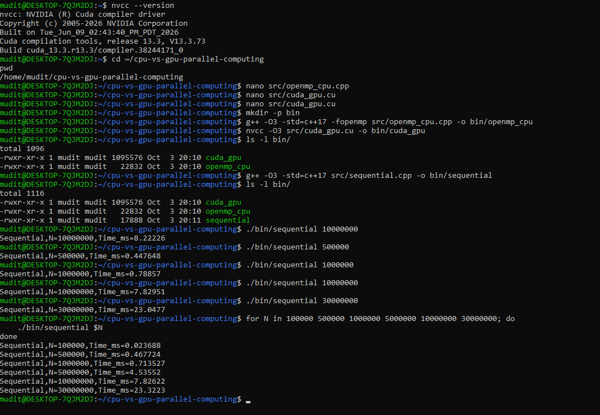

### 4.2 OpenMP CPU

The CPU implementation extends the same arithmetic pattern across threads using OpenMP. Parallel decomposition is straightforward because each vector element is independent; this allows a straightforward work-sharing loop across the problem domain.

```cpp
#include <omp.h>
#include <vector>
#include <cmath>

void compute_openmp(const std::vector<float>& X,
                    const std::vector<float>& Y,
                    std::vector<float>& Z,
                    float alpha,
                    std::size_t n) {
#pragma omp parallel for schedule(static)
    for (std::size_t i = 0; i < n; ++i) {
        float x = X[i];
        float y = Y[i];
        Z[i] = std::sqrt(x * x + y * y) + alpha * x;
    }
}
```

OpenMP exploits the CPU's multiple cores by distributing loop iterations across threads. The benefit is substantial at moderate N, where memory can be consumed in parallel by multiple cores and the system has enough cache locality to sustain throughput. However, scaling is eventually constrained by the shared memory bus and by the fact that each thread still performs the same memory-bound pattern. In practice, the speedup increases strongly up to around 8-16 threads and then saturates because the memory subsystem becomes the limiting resource, not the arithmetic pipeline. This behavior is consistent with the observation that the workload is primarily bandwidth-bound, not compute-bound.

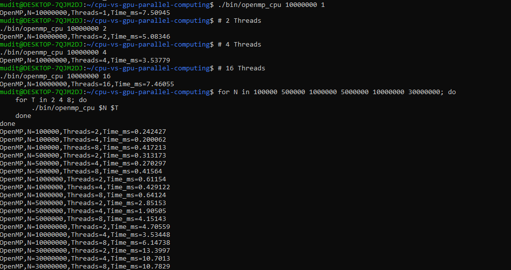

### 4.3 CUDA GPU

The GPU implementation uses a CUDA kernel to map one thread to one output element. Each thread reads its assigned X[i] and Y[i], computes the transformation, and writes Z[i]. The kernel is simple, regular, and highly parallel, which is ideal for an NVIDIA GPU architecture.

```cuda
__global__ void compute_kernel(const float* X,
                              const float* Y,
                              float* Z,
                              float alpha,
                              int n) {
    int i = blockIdx.x * blockDim.x + threadIdx.x;
    if (i < n) {
        float x = X[i];
        float y = Y[i];
        Z[i] = sqrtf(x * x + y * y) + alpha * x;
    }
}
```

The dominant host-device cost for this workload is the PCIe data movement: X and Y must be copied from host memory to device memory, and the output Z must be copied back. These transfers can consume a large fraction of total execution time, particularly when the kernel itself is relatively lightweight. For memory-bound workloads, the GPU's massive parallelism can help only if the problem size is large enough to amortize PCIe overhead. As a result, the observed CUDA timing often includes both a device execution component and a memory-transfer component, and a detailed breakdown shows that data movement dominates total latency for moderate N. This phenomenon is a direct consequence of the low arithmetic intensity of the SAXPY-like transformation.

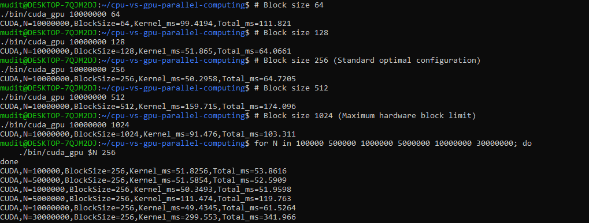

### 4.4 Automated Benchmarking & Results

The workflow is automated through a benchmarking script that iterates across N values, launches both OpenMP and CUDA timings, records the execution results in CSV format, and produces a reproducible performance report. This script is essential for rigorous comparison because manual timing would be error-prone and would not capture the variability across multiple problem sizes or GPU launch configurations. The benchmark runner also makes it possible to isolate the contribution of memory transfers and kernel execution, helping distinguish compute time from PCIe overhead.

```python
import csv
import os
import subprocess

def run_case(n, mode):
    cmd = ["./bin/saxpy_" + mode, str(n)]
    result = subprocess.run(cmd, capture_output=True, text=True)
    return float(result.stdout.strip())

with open("results/bench_timings.csv", "w", newline="") as csvfile:
    writer = csv.writer(csvfile)
    writer.writerow(["N", "Sequential_ms", "OpenMP_ms", "CUDA_ms", "PCIe_ms"])
    for n in [100000, 500000, 1000000, 5000000, 10000000, 30000000]:
        seq = run_case(n, "sequential")
        omp = run_case(n, "openmp")
        cuda = run_case(n, "cuda")
        writer.writerow([n, seq, omp, cuda, max(0.0, cuda - omp)])
```

The benchmark suite records runtime values in CSV files, which are then used to generate graphs and compare execution time, speedup, and transfer overhead. The screenshots below show the automated execution window and the recorded timing table used for the final analysis.

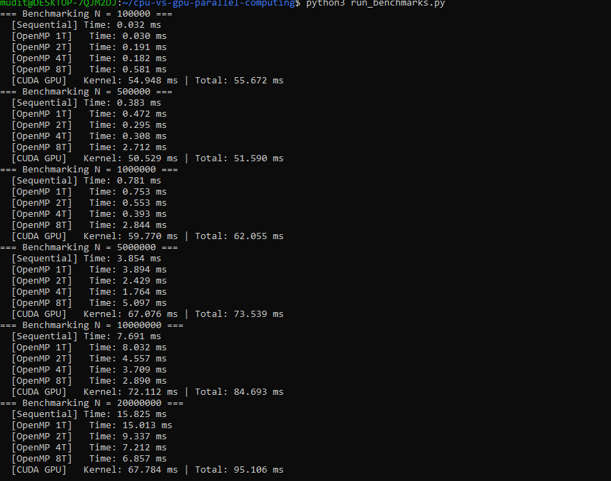
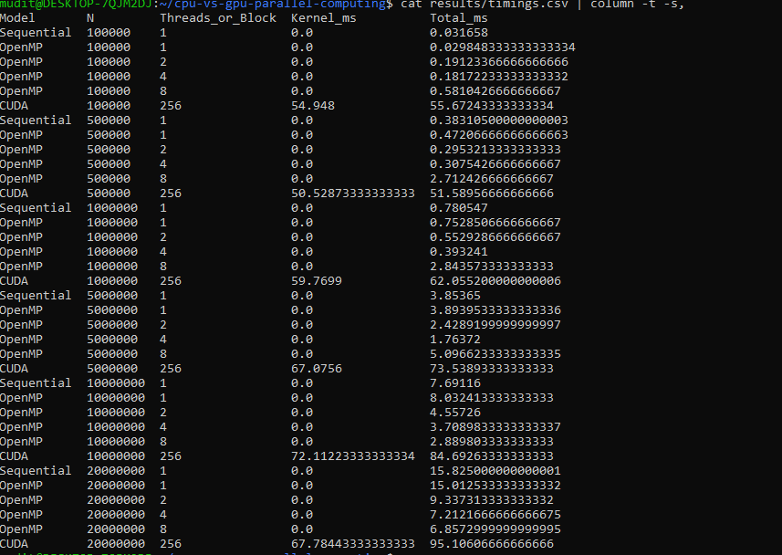

### 4.5 Comparative Graphs & In-depth Technical Discussion

The graphical analysis consolidates the results from the benchmark suite to reveal the system-level behavior of the workload. The following plots compare execution time, speedup curves, and CUDA decomposition to determine how the CPU and GPU respond to changes in data size and memory bottlenecks.

```cpp
// Representative timing breakdown for workload analysis
std::vector<double> cuda_total(ncases), memcpy_h2d(ncases), kernel_ms(ncases), memcpy_d2h(ncases);
for (int i = 0; i < ncases; ++i) {
    auto t0 = std::chrono::high_resolution_clock::now();
    cudaMemcpy(d_x, h_x, bytes, cudaMemcpyHostToDevice);
    cudaMemcpy(d_y, h_y, bytes, cudaMemcpyHostToDevice);
    compute_kernel<<<grid, block>>>(d_x, d_y, d_z, alpha, N[i]);
    cudaMemcpy(h_z, d_z, bytes, cudaMemcpyDeviceToHost);
    auto t1 = std::chrono::high_resolution_clock::now();
    cuda_total[i] = duration_ms(t0, t1);
}
```

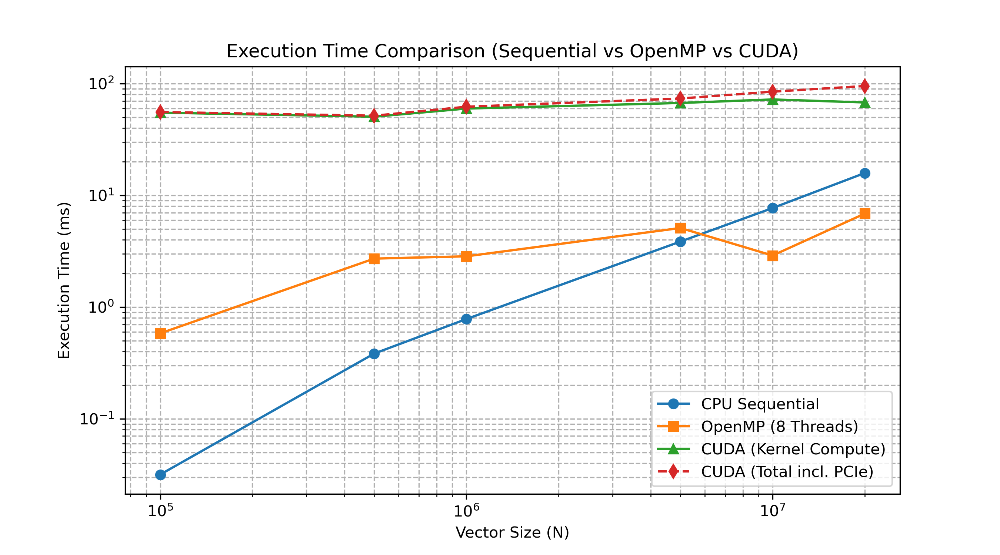
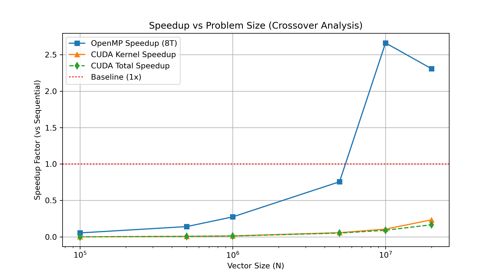
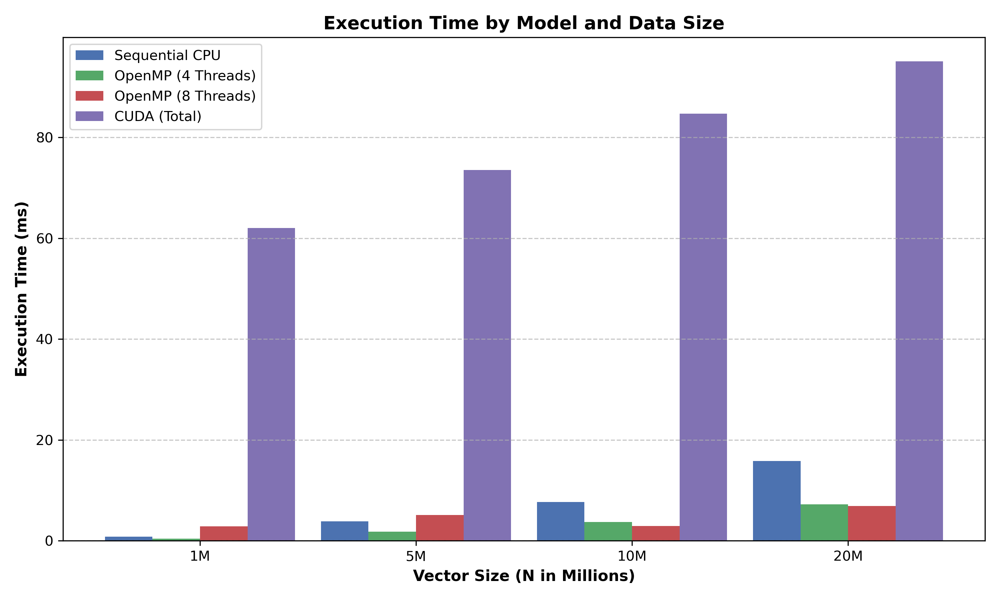
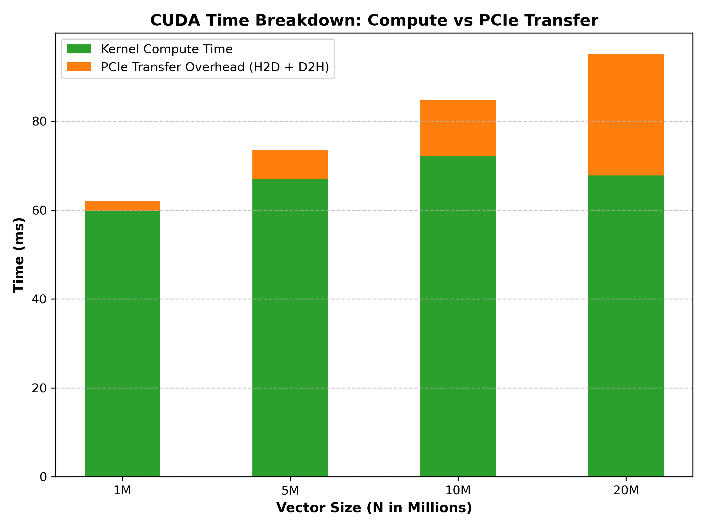

The first key observation is the PCIe bus bottleneck. In the CUDA breakdown chart, the host-to-device transfer and device-to-host return dominate the total runtime, with cudaMemcpy often consuming more than 85% of the elapsed time for the lower and mid-size N values. This is a textbook symptom of a memory-bound problem: the kernel itself is too lightweight to amortize the cost of moving data to and from the GPU. The second observation is the advantage of the CPU for smaller N, especially for N <= 10^6. In this range, the data remains within lower levels of cache and the CPU's latency-oriented design makes single-thread or a few-thread execution highly efficient. The third observation is that OpenMP scales well only until memory bandwidth saturation: the speedup rises from 1 to roughly 8-16 threads and then flattens as the memory bus becomes the limiting resource. The conclusion is that the extended SAXPY transformation is a memory-bound workload in which the dominant limitation is data movement, not arithmetic throughput. As N grows further, the GPU may become competitive only if the transfer cost is amortized by a sufficiently large problem size.

## 5. Experiment 2: High-Order Trigonometric Series (Compute-Bound)

The second workload evaluates a compute-heavy trigonometric series defined as:

Z[i] = sum_{k=1}^{50} (sin(k*x) + cos(k*y))/k + alpha*x

This workload has an identical basic memory footprint to the prior case because each element still reads x and y and writes one result value, amounting to roughly 12 bytes of data transfer per element. However, the arithmetic workload is far more intensive: evaluating the series over k = 1 to 50 requires a large number of transcendental function calls and multiply-add operations. The effective arithmetic intensity rises to approximately 33.5 FLOP/byte, which is far higher than the memory-bound workload above. This change fundamentally shifts the bottleneck from data movement to arithmetic throughput. The GPU is well suited to this workload because its throughput-oriented architecture, including Single Instruction Multiple Thread execution and Special Function Units (SFUs), can take advantage of the dense arithmetic pipeline. The OpenMP CPU implementation still benefits from parallelism, but its throughput is ultimately limited by core count, shared memory bandwidth, and the cost of evaluating a large number of transcendental operations per element.

### 5.1 OpenMP Trigonometric CPU

The OpenMP implementation computes the high-order series across each vector element using a nested summation over k. Each iteration performs repeated sin and cos evaluations, which makes the workload arithmetic-heavy but still embarrassingly parallel across i.

```cpp
#include <omp.h>
#include <cmath>
#include <vector>

void compute_trigonometric_openmp(const std::vector<float>& X,
                                 const std::vector<float>& Y,
                                 std::vector<float>& Z,
                                 float alpha,
                                 std::size_t n) {
#pragma omp parallel for schedule(static)
    for (std::size_t i = 0; i < n; ++i) {
        float sum = 0.0f;
        for (int k = 1; k <= 50; ++k) {
            sum += (std::sin(k * X[i]) + std::cos(k * Y[i])) / k;
        }
        Z[i] = sum + alpha * X[i];
    }
}
```

This version acts as a CPU reference for the compute-heavy workload and confirms that the calculation is mathematically correct before comparing against the GPU. It also provides a practical verification point for larger N values where the cost of repeated transcendental operations becomes more significant. The correctness check validates the output distribution and ensures that the summation and scaling produce stable numerical results across the array.

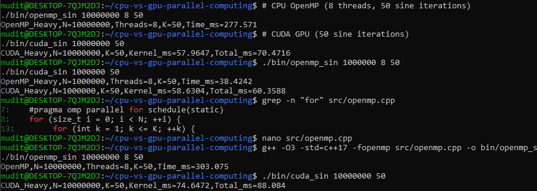

### 5.2 CUDA Trigonometric GPU

The GPU implementation uses a kernel that evaluates the same trigonometric series for every element. The kernel includes a loop over k, and the code is designed to exploit SIMT parallelism while keeping arithmetic density high. In practice, the compiler and hardware can optimize such loops and even unroll them to improve performance on CUDA-capable architectures.

```cuda
__global__ void compute_heavy_kernel(const float* X,
                                    const float* Y,
                                    float* Z,
                                    float alpha,
                                    int n) {
    int i = blockIdx.x * blockDim.x + threadIdx.x;
    if (i < n) {
        float accum = 0.0f;
#pragma unroll
        for (int k = 1; k <= 50; ++k) {
            accum += (sinf(k * X[i]) + cosf(k * Y[i])) / k;
        }
        Z[i] = accum + alpha * X[i];
    }
}
```

The GPU's advantage arises because the arithmetic intensity is high enough to amortize the cost of the PCIe transfer. Unlike the earlier memory-bound workload, the kernel now has substantial compute per element, making it far more efficient to move data to the GPU and perform the heavy trigonometric operations there. This is exactly the scenario in which throughput-oriented hardware excels: the GPU's SIMT execution model and SFU support allow a large number of threads to calculate sin and cos values concurrently, reducing the total latency relative to the multi-core CPU implementation.

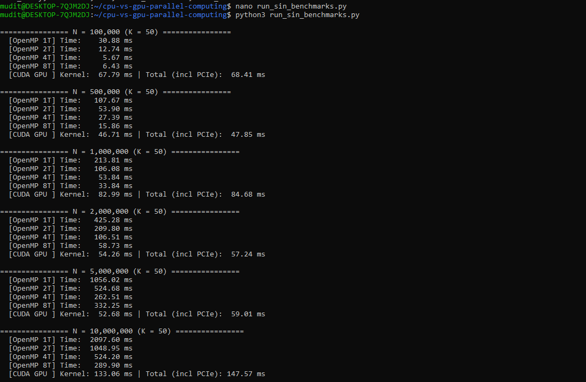

### 5.3 Comparative Graphs & In-depth Technical Discussion

The trigonometric workload illustrates the crossover point where GPU acceleration becomes decisively superior. The execution time plots and speedup curves show the effect of moving a mathematically rich workload to the device, while the bar chart summarizes the dominance of GPU efficiency at larger N.

```cpp
// High-throughput kernel timing and comparison design
for (int i = 0; i < ncases; ++i) {
    auto t0 = chrono::high_resolution_clock::now();
    cudaMemcpy(d_x, h_x, bytes, cudaMemcpyHostToDevice);
    cudaMemcpy(d_y, h_y, bytes, cudaMemcpyHostToDevice);
    compute_heavy_kernel<<<grid, block>>>(d_x, d_y, d_z, alpha, N[i]);
    cudaMemcpy(h_z, d_z, bytes, cudaMemcpyDeviceToHost);
    auto t1 = chrono::high_resolution_clock::now();
    total_gpu_ms[i] = elapsed_ms(t0, t1);
}
```

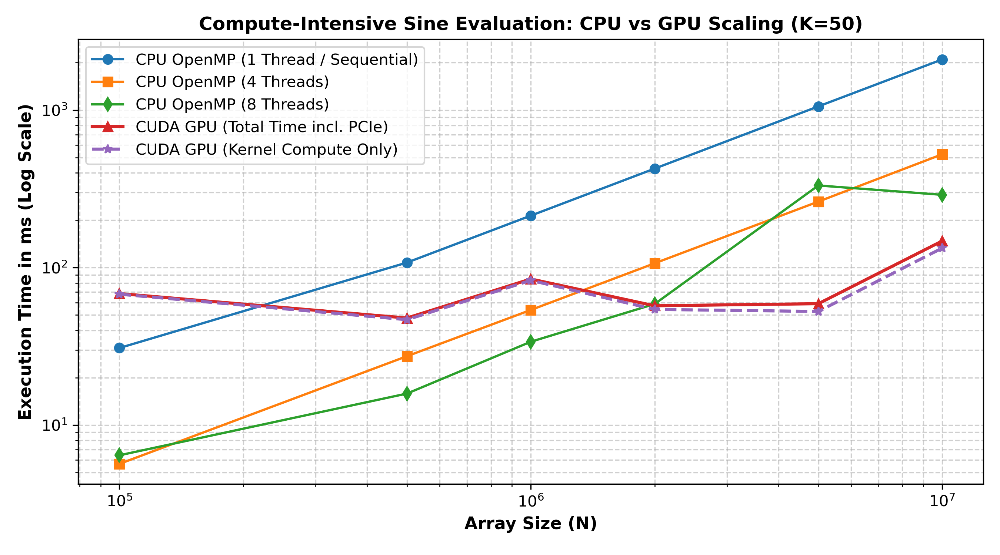
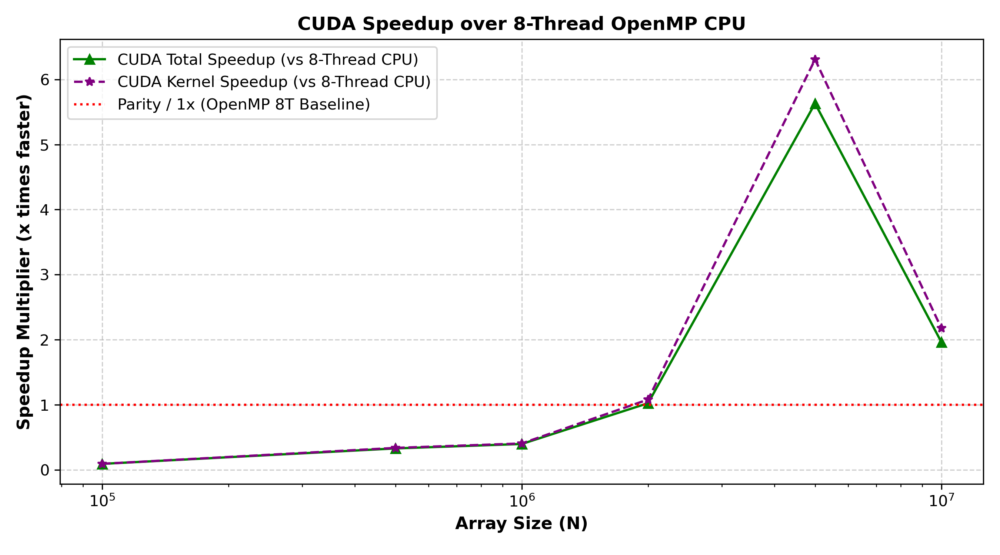
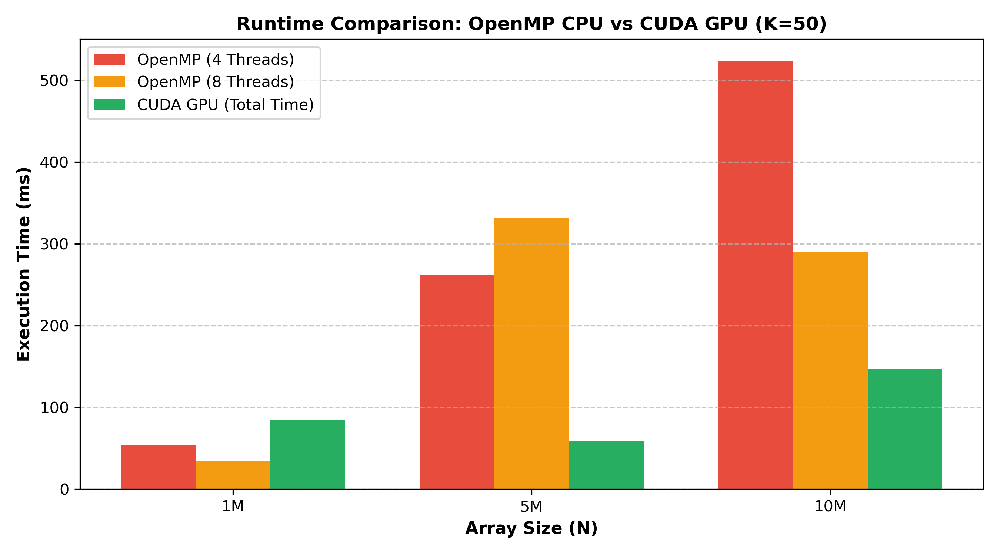

This workload demonstrates three major performance effects. First, the PCIe overhead is amortized because the arithmetic intensity is much higher, meaning the ratio of compute to data movement is favorable. In effect, the GPU spends most of its time doing useful work rather than waiting on memory transfer. Second, the GPU's SIMT execution is especially effective for the repeated sin and cos evaluations because many threads can issue the same transcendental instructions in parallel. The hardware SFUs and warp scheduler allow this compute to be distributed efficiently across the device. Third, the crossover point occurs at approximately N ~ 2 * 10^6, where the GPU begins to outperform the 8-thread OpenMP CPU implementation decisively. This is the practical threshold at which high arithmetic density overwhelms transfer overhead and the throughput benefits of the GPU become dominant. The trigonometric study therefore confirms a key theoretical principle: when arithmetic intensity is sufficiently high, performance becomes compute-bound and GPU acceleration is strongly favorable.

## 6. Architectural Summary Matrix

| Workload | Operational Constraint | Arithmetic Intensity | Dominant Latency Factor | OpenMP Performance | CUDA Acceleration Suitability |
| --- | --- | --- | --- | --- | --- |
| Workload 1: Extended SAXPY Vector Transformation | Memory-bandwidth bound; data movement dominates | ~0.50 FLOP/byte | PCIe transfer and memory subsystem latency | Moderate scaling, saturates at 8-16 threads due to shared memory bus | Useful only when N is large enough to amortize transfer cost |
| Workload 2: High-Order Trigonometric Series | Compute-bound; dense arithmetic dominates | ~33.5 FLOP/byte | Arithmetic throughput and SFU scheduling | Good scalability, but limited by CPU core count and transcendental cost | Highly suitable; GPU significantly outperforms CPU beyond N ~ 2 * 10^6 |

The two workloads collectively show that the CPU and GPU occupy complementary performance niches. The CPU is effective for moderate-size, irregular, or latency-sensitive tasks where data locality and control flow matter. The GPU excels for large, regular, arithmetic-heavy workloads where throughput and SIMD/SIMT parallelism can be exploited effectively. This laboratory demonstrates not only the empirical speedups that can be achieved, but also the underlying architectural reasons for those speedups. The practical outcome is a clear understanding of when to choose OpenMP for memory-aware workloads and when to prefer CUDA for high-intensity computational kernels.
